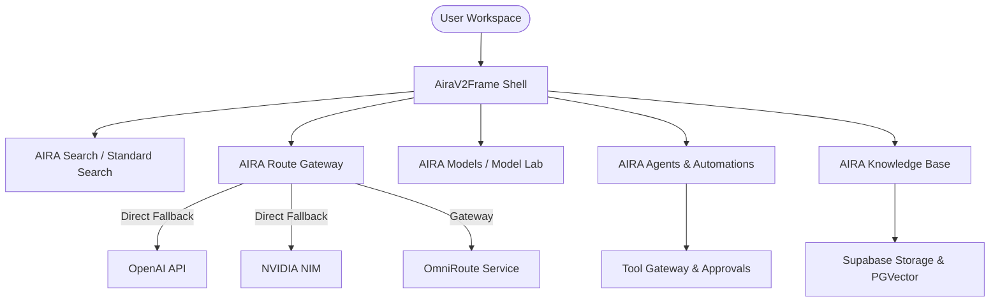

# AIRA AI — Release 3 Runtime Architecture

## Architecture Overview

AIRA AI Release 3 integrates modern Next.js App Router workspace frames with modular intelligence sub-systems.

## Renaming & Presentation Abstraction Layer

User-facing feature surfaces are decoupled from internal infrastructure names:

- **AIRA Route**: Exposes OmniRoute gateway routing logic with direct provider fallback.
- **AIRA Search**: Primary grounded research surface.
- **AIRA Command Center**: System operational telemetry and health.
- **AIRA Browser**: Remote browser automation surface (canonical `/browser`).
- **AIRA Automations**: Workflows and scheduled routines.
- **AIRA Outputs**: Durable deliverables, artifacts, and provenance records.
- **AIRA Models**: Model comparison and entitlement evaluation.
- **AIRA Connections**: Third-party provider credentials and settings.
- **AIRA Teams**: Swarm multi-agent orchestration.

## Execution & Gate Safety

- **Fail-Closed Billing**: Cashfree/Stripe checkouts are gated by explicit configuration flags (`CASHFREE_CHECKOUT_ENABLED=false`).
- **Async Verification**: Identity and governance checks avoid infinite loading states by evaluating `NOT CONFIGURED` or `PERMISSION REQUIRED` fallbacks.
