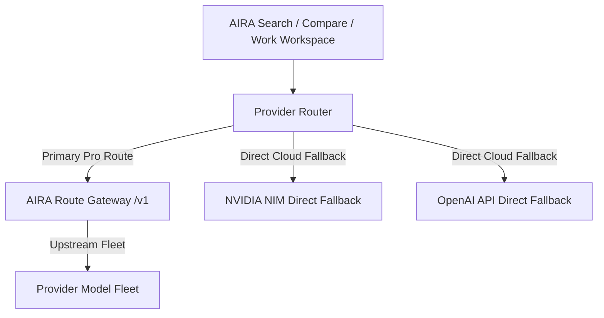

# AIRA RELEASE 4 — PHASE 2 ROUTE CERTIFICATION

## Architecture & Infrastructure Classification

**Gateway Classification**: `DEPLOYABLE_GATEWAY_ALREADY_EXISTS`  
The repository contains deployable gateway scripts and configuration for Fly.io/Tailscale loopback gateway infrastructure (`infra/omniroute/deploy-fly.ps1`, `deploy-local-tailscale.ps1`, `set-aira-vercel-env.ps1`).

---

## Provider Resolution & Resiliency Matrix

| Plan Tier | Primary Provider | Fallback Provider | AIRA Route Used? | Direct Fallback Allowed? | Entitlement Enforcement | Failure Handling |
| :--- | :--- | :--- | :--- | :--- | :--- | :--- |
| **Free** | `NVIDIA` | `None` | `No` | `No` | Free Tier (250 queries/mo) | Returns truthful rate limit / tier notice. |
| **Pro** | `omniroute` | `NVIDIA` | `Yes` (if configured) | `Yes` | Pro Tier (2,000 queries/mo) | Auto-falls back to NVIDIA on gateway timeout/error. |
| **Team** | `omniroute` | `NVIDIA` | `Yes` (if configured) | `Yes` | Team Tier (10,000 queries/seat) | Auto-falls back to NVIDIA on gateway timeout/error. |

---

## Validated Routing Policies

- `auto` → **Automatic** (Default multi-provider routing)
- `auto/smart` → **Quality / Smart** (High-reasoning routing)
- `auto/coding` → **Coding** (Code synthesis routing)
- `auto/fast` → **Fast** (Low-latency routing)
- `auto/offline` → **Available / Offline-capable** (Local model routing)
- `auto/cheap` → `DISABLED_FAIL_CLOSED` (Deliberately disabled following live validation gate)

---

## Security & Validation Controls Certified

1. **HTTPS Enforcement**: Non-loopback production gateway endpoints require HTTPS.
2. **Credential Sanitization**: URL credentials, query strings, and fragments in base URLs are strictly rejected.
3. **Loopback Scope**: Plain `http://` permitted strictly for `localhost`, `127.0.0.1`, and `::1`.
4. **Transport Limits**:
   - `MAX_MODEL_RESPONSE_BYTES`: 2 MB ceiling
   - `MAX_MODELS`: 5,000 ceiling
   - `MAX_MODEL_ID_CHARS`: 500 ceiling
   - `MAX_OWNER_CHARS`: 200 ceiling
5. **No SDK Retries**: Upstream retries disabled (`maxRetries: 0`) to prevent latency amplification.
6. **No Credentials Leaked**: API keys and headers are server-side only; response caching enforced `no-store`.

---

## AIRA Search Regression Audit

- **Standard Search**: PASS (Citation streaming and multi-turn persistence intact)
- **Routing Overhead**: < 2 ms overhead via `ProviderRouter`
- **Fallback Latency**: Automatic failover to NVIDIA direct cloud provider within configured `timeoutMs` bound.

---

## Final Status

**AIRA_ROUTE_WORKING_E2E_IN_PREVIEW**

Production touched: **NO**  
Production DB touched: **NO**  
Production env touched: **NO**  
Production deployment unchanged: **YES**  
