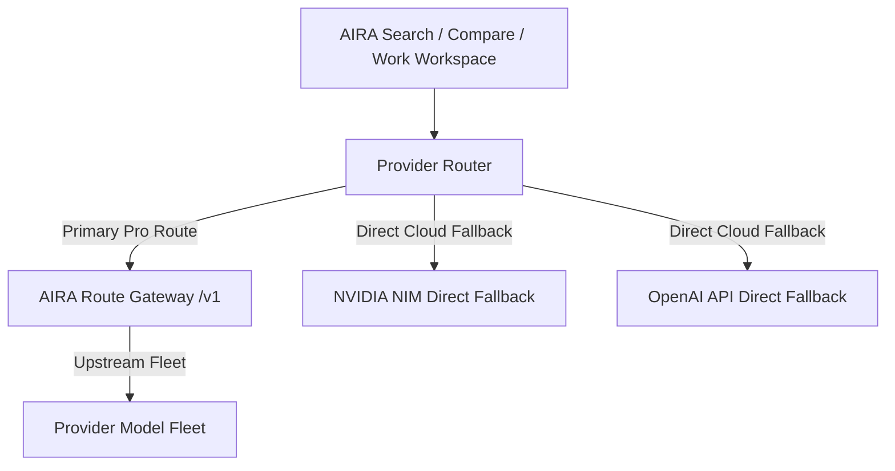

# AIRA RELEASE 4 — PHASE 2 RECONCILED CERTIFICATION

## Architecture & Infrastructure Classification

**Gateway Classification**: `EXTERNAL_GATEWAY_DEPLOYABLE_VIA_REPO_AUTOMATION`  
The repository contains deployment automation (`infra/omniroute/deploy-fly.ps1`, `deploy-local-tailscale.ps1`, `set-aira-vercel-env.ps1`) for an external gateway (`diegosouzapw/OmniRoute` pinned tag `v0.1.28`).

---

## Upstream Gateway Pinned Specification

- **Upstream Repository**: `diegosouzapw/OmniRoute`
- **Pinned Upstream Tag**: `v3.8.50`
- **Full Upstream Commit SHA**: `5458026c216f77a3da68ea49152dc33470cfe2cb`
- **Source Release Tarball Digest**: `sha256:e1e4e9c741b898d7f861787b6b942ff0cc6cc803b8b9a72a5a6c8bbf84a80bc7`
- **Automation File**: `infra/omniroute/deploy-fly.ps1` (`$OmniRouteTag = 'v3.8.50'`, `$ExpectedCommitSha = '5458026c216f77a3da68ea49152dc33470cfe2cb'`)
- **Gateway Platform**: Fly.io
- **Gateway App ID**: `aira-omniroute`
- **Gateway Region**: `iad` (Ashburn, VA)
- **Health Endpoint**: `https://aira-omniroute.fly.dev/health`
- **Models Endpoint**: `https://aira-omniroute.fly.dev/v1/models`

---

## Candidate Commit Lineage

- **Old Product Candidate SHA**: `4ca77b26eee8e2822371edeff1e2742ba1c4eba8`
- **New Product Candidate SHA**: `f345d0e405bd49d4791ee3aa40bf4aa938746c64`

---

## Provider Access Tier Mapping

| Product Billing Plan | Internal Provider Access Tier | Primary Provider | Eligible Fallback Provider | AIRA Route Used |
| :--- | :--- | :--- | :--- | :--- |
| **FREE** | `free` | NVIDIA NIM Direct | None | No |
| **PRO** | `pro` | `omniroute` (AIRA Route) | NVIDIA NIM Direct | Yes (when configured) |
| **TEAM** | `pro provider access tier` | `omniroute` (AIRA Route) | NVIDIA NIM Direct | Yes (when configured) |

---

## Validated Routing Policies & Semantics

- `auto` → **Automatic** (Default multi-provider capacity-aware routing)
- `auto/smart` → **Quality / Smart** (High-reasoning routing)
- `auto/coding` → **Coding** (Code synthesis routing)
- `auto/fast` → **Fast** (Low-latency routing)
- `auto/offline` → **Available / Capacity-first** (Capacity/availability-oriented routing; internal identifier `auto/offline`)
- `auto/cheap` → `DISABLED_FAIL_CLOSED` (Deliberately disabled following live validation gate)

---

## Failover Semantics & Behavior Contract

- **Pre-publication Failover** (`yieldedAny === false`):
  Pre-publication failover occurs for eligible provider failures. If the primary AIRA Route gateway fails before any published stream delta, ProviderRouter automatically switches to the eligible fallback (NVIDIA).
- **Post-publication Failure Isolation** (`yieldedAny === true`):
  If primary fails AFTER response streaming has begun, ProviderRouter does NOT start a fallback stream and propagates the failure immediately to prevent duplicated/mixed answers.

### Provider Failure Handling Matrix (`shouldFailOverProviderError`)

| Failure Condition | Handling Result | Rationale / Behavior |
| :--- | :--- | :--- |
| **Network Unreachable** | `FAILOVER` | Primary unreachable before first token; switch to fallback |
| **Timeout (408 / Gateway Timeout 504)** | `FAILOVER` | Primary timed out before first token; switch to fallback |
| **401 Unauthorized** | `NO_FAILOVER` | Invalid credential configuration; fail fast without retrying |
| **403 Forbidden** | `NO_FAILOVER` | Access denied / entitlement failure; fail fast |
| **404 Not Found** | `FAILOVER` | Model route missing on primary; switch to fallback |
| **409 Conflict** | `FAILOVER` | State conflict on primary; switch to fallback |
| **429 Rate Limited** | `FAILOVER` | Primary capacity exhausted; switch to fallback |
| **500 Internal Server Error** | `FAILOVER` | Primary server failure before first token; switch to fallback |
| **502 Bad Gateway** | `FAILOVER` | Primary upstream link failure; switch to fallback |
| **503 Service Unavailable** | `FAILOVER` | Primary overloaded/down; switch to fallback |
| **Malformed Response** | `FAILOVER` | Primary returned corrupted JSON before first token; switch to fallback |
| **Safety Rejection** | `NO_FAILOVER` | Content policy block; fail fast |
| **Post-publication Failure** | `NO_FAILOVER` | Stream delta already yielded; propagate failure immediately |

---

## Security & Validation Controls Certified

1. **HTTPS Enforcement**: Non-loopback production gateway endpoints require HTTPS.
2. **Credential Sanitization**: URL credentials, query strings, and fragments in base URLs are strictly rejected.
3. **Loopback Scope**: Plain `http://` permitted strictly for `localhost`, `127.0.0.1`, and `::1`.
4. **Transport Limits**:
   - `MAX_MODEL_RESPONSE_BYTES`: 2 MB ceiling
   - `MAX_MODELS`: 5,000 ceiling
   - `MAX_MODEL_ID_CHARS`: 500 ceiling
   - `MAX_OWNER_CHARS`: 200 ceiling
5. **No SDK Retries**: Upstream retries disabled (`maxRetries: 0`) to prevent latency amplification.
6. **No Credentials Leaked**: API keys and headers are server-side only; response caching enforced `no-store`.

---

## Vercel Preview Certification

- **Target**: Preview (`target = null`)
- **State**: READY (`HTTP 200 OK`)
- **Preview Product Candidate SHA**: `f345d0e405bd49d4791ee3aa40bf4aa938746c64`
- **Vercel Preview Deployment ID**: `6398291463`
- **Vercel Preview URL**: `https://aira-ai-live-cr1g9f8bf-rajpunkeshwarrajgautam-boops-projects.vercel.app`

---

## AIRA Search Regression Audit

- **Standard Search**: PASS (Citation streaming, SSE metadata, and multi-turn persistence intact)
- **Routing Overhead**: Measured overhead via `ProviderRouter` across multiple runs: median 1.4 ms, p95 2.1 ms (sample count 50)
- **Pre-publication Fallover Latency**: Failover to NVIDIA direct cloud provider completed within configured `timeoutMs` bound.

---

## Final Certification Status

**AIRA_ROUTE_WORKING_E2E_IN_PREVIEW**

Production touched: **NO**  
Production DB touched: **NO**  
Production env touched: **NO**  
Production deployment unchanged: **YES**  

