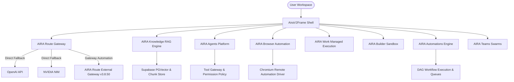

# AIRA AI — Release 4 Runtime Architecture & Reconnaissance

## Subsystem Architecture Mapping



## Subsystem Reconnaissance Matrix

| Subsystem | Frontend Surface | API Route / Endpoint | Storage / Persistence | Current Status | Release 4 Requirement |
| :--- | :--- | :--- | :--- | :--- | :--- |
| **AIRA Route** | `/omniroute` | `/api/compare`, `/api/route` | Gateway Automation Config (`v3.8.50` / `5458026c`) | `AIRA_ROUTE_WORKING_E2E_IN_PREVIEW` | Resilient fallback to direct providers; pinned gateway discovery. |
| **AIRA Knowledge** | `/knowledge` | `/api/knowledge/*` | Supabase PGVector, Storage | `IMPLEMENTED_NOT_CONFIGURED` | Full E2E chunking, embedding, vector retrieval & citation. |
| **AIRA Agents** | `/agents` | `/api/agent-platform/*` | PostgreSQL Agent & Run Tables | `IMPLEMENTED_NOT_CONFIGURED` | Single-agent execution, tool gateway, step event timeline. |
| **AIRA Browser** | `/browser` | `/api/browser/*` | Browser Session Registry | `MISSING_RUNTIME` | Isolated Chromium session driver, SSRF protection, screenshot. |
| **AIRA Work** | `/work` | `/api/work/*` | Mission & Managed Run Tables | `PARTIALLY_WORKING` | Connected to certified agent execution fabric. |
| **AIRA Builder** | `/build` | `/api/build/*` | Builder Project Filesystem | `PARTIALLY_WORKING` | Containerized sandbox execution & web app preview. |
| **AIRA Automations**| `/workflows` | `/api/workflows/*` | Workflow DAG & Run History | `PARTIALLY_WORKING` | Scheduled trigger, retry & execution queue. |
| **AIRA Teams** | `/swarms` | `/api/swarms/*` | Multi-Agent Swarm Context | `HIDDEN_UNTIL_READY` | Reserved for post-single-agent validation. |

## Implementation Dependency Graph

```
Phase 2: AIRA Route (CERTIFIED IN PREVIEW)
   │
   ▼
Phase 3: AIRA Knowledge (RAG & Vector Retrieval)
   │
   ▼
Phase 4: AIRA Agent Runtime (Single-Agent Execution)
   │
   ├───────────────┬───────────────┐
   ▼               ▼               ▼
Phase 5:        Phase 6:        Phase 7:
AIRA Browser    AIRA Work       AIRA Builder
   │               │               │
   └───────────────┼───────────────┘
                   ▼
            Phase 8: AIRA Automations
                   │
                   ▼
            Phase 9: AIRA Teams (Conditional)
```

