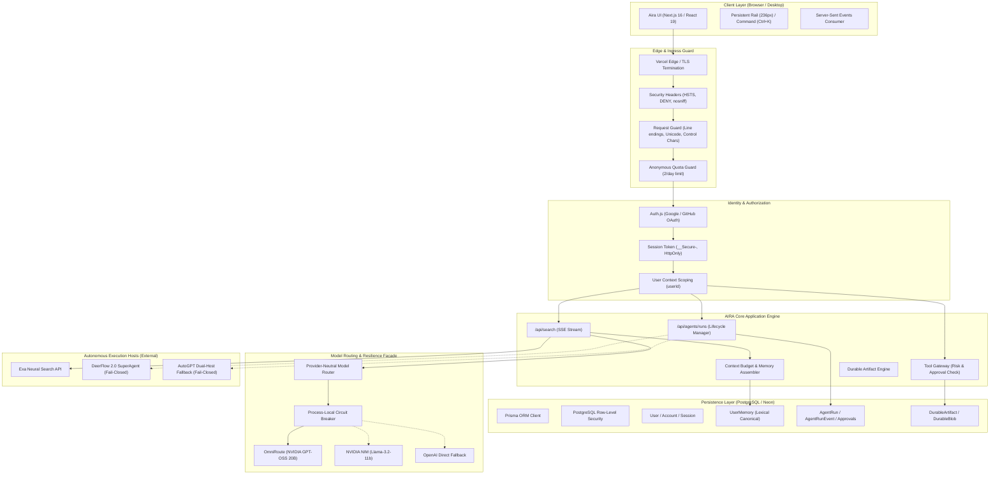

# AIRA AI — Technical Architecture and Engineering Reference

> **Document Type**: Authoritative Technical Architecture Reference  
> **Status**: Active / Production Baseline (Reconciled with v5.1 Work Runtime)
> **Baseline Candidate SHA**: `23472e97bf028283ee9c25656ab1440fe4fdadf5` (PR #133: OPEN / UNMERGED)  
> **Last Verified**: 2026-09-20  
> **Repository Root**: [c:/Users/WORKSTATION/aira-ai](file:///c:/Users/WORKSTATION/aira-ai)  
> **Production Deployment**: [https://aira-ai-live.vercel.app](https://aira-ai-live.vercel.app)  
> **Related Documents**:
> - Product Requirements: [docs/PRD.md](file:///c:/Users/WORKSTATION/aira-ai/docs/PRD.md)
> - Engineering Guardrails: [docs/RULES.md](file:///c:/Users/WORKSTATION/aira-ai/docs/RULES.md)
> - Design System: [docs/DESIGN.md](file:///c:/Users/WORKSTATION/aira-ai/docs/DESIGN.md)
> - Task Ledger: [docs/TASKS.md](file:///c:/Users/WORKSTATION/aira-ai/docs/TASKS.md)
> - Operational Memory: [docs/MEMORY.md](file:///c:/Users/WORKSTATION/aira-ai/docs/MEMORY.md)
> - Historical Runtime Reference: [docs/AIRA_RUNTIME_ARCHITECTURE.md](file:///c:/Users/WORKSTATION/aira-ai/docs/AIRA_RUNTIME_ARCHITECTURE.md)

---

## 1. System Overview

AIRA AI is engineered as a layered, fail-closed AI research and autonomous execution instrument. Its primary operational premise is **layered ownership with explicit trust boundaries**: incoming requests, untrusted search excerpts, long-term memory, tool executions, AI model outputs, and publication each traverse independently monitored isolation perimeters.

AIRA AI operates as a monorepo consisting of:
1. **Web Application & Control Plane**: Next.js 16 App Router application deployed to Vercel.
2. **Persistence & Data Isolation**: Neon PostgreSQL with Prisma ORM and Supabase Row-Level Security (RLS).
3. **Model Routing & AI Gateway**: OmniRoute multi-provider gateway with automatic fallback to NVIDIA NIM and OpenAI.
4. **Autonomous Execution Plane**: DeerFlow 2.0 SuperAgent and AutoGPT runner integrations with human-in-the-loop tool approvals.
5. **Durable Artifact & Blob Storage**: Multi-format generation engine and byte-level `DurableBlob` storage.
6. **Desktop Companion**: Electron / Vite application for native desktop capabilities.

---

## 2. Verified Technology Stack

| Layer | Technology | Exact Version | Configuration File |
| :--- | :--- | :--- | :--- |
| **Package Management** | pnpm | `10.28.1` | [package.json](file:///c:/Users/WORKSTATION/aira-ai/package.json#L2) |
| **Monorepo Engine** | Turborepo | `2.9.6` | [turbo.json](file:///c:/Users/WORKSTATION/aira-ai/turbo.json) |
| **Web Framework** | Next.js (App Router) | `16.3.3` | [apps/web/package.json](file:///c:/Users/WORKSTATION/aira-ai/perplexity-clone/my-turborepo/apps/web/package.json#L29) |
| **UI Library** | React / React DOM | `19.2.8` | [apps/web/package.json](file:///c:/Users/WORKSTATION/aira-ai/perplexity-clone/my-turborepo/apps/web/package.json#L33-L34) |
| **Styling & Tokens** | Tailwind CSS | `3.4.17` | [apps/web/tailwind.config.ts](file:///c:/Users/WORKSTATION/aira-ai/perplexity-clone/my-turborepo/apps/web/tailwind.config.ts) |
| **Database ORM** | Prisma | `7.9.1` | [prisma/schema.prisma](file:///c:/Users/WORKSTATION/aira-ai/prisma/schema.prisma) |
| **Database Engine** | PostgreSQL (Neon / Supabase) | PostgreSQL 16+ | [prisma.config.ts](file:///c:/Users/WORKSTATION/aira-ai/prisma.config.ts) |
| **Authentication** | NextAuth (Auth.js) | `5.0.0-beta.32` | [apps/web/lib/auth-origin.ts](file:///c:/Users/WORKSTATION/aira-ai/perplexity-clone/my-turborepo/apps/web/lib/auth-origin.ts) |
| **Schema Validation** | Zod | `4.3.6` | [apps/web/lib/contracts/](file:///c:/Users/WORKSTATION/aira-ai/perplexity-clone/my-turborepo/apps/web/lib/contracts/) |
| **Search Retrieval** | Exa API | REST | [apps/web/lib/search/](file:///c:/Users/WORKSTATION/aira-ai/perplexity-clone/my-turborepo/apps/web/lib/search/) |
| **Test Runner** | Node.js Test Runner | Node 22 native | `apps/web/test/*.test.ts` |
| **Desktop Shell** | Electron / Vite | Node 22 / Vite 5 | `desktop-agent/` |

---

## 3. Verified Repository Architecture

```text
aira-ai/
├── .agents/                               # Master Agent router rules and workspace skills
│   ├── rules/router.md                   # Canonical multi-agent routing policy
│   └── skills/                           # Local workspace skills (toolkits & references)
├── .github/workflows/                     # Path-scoped CI/CD pipelines
├── docs/                                  # Central project intelligence & release records
├── infra/                                 # Infrastructure provisioning, workers, and runtimes
│   ├── aira-runtime/                     # Single-command Linux runtime bootstrap
│   ├── autogpt-runner/                   # AutoGPT dual-host execution adapter
│   └── deerflow-runner/                  # DeerFlow 2.0 SuperAgent deployment scripts
├── perplexity-clone/my-turborepo/
│   └── apps/web/                         # Primary Next.js 16 production web application
│       ├── app/                          # App Router pages, layouts, and API routes
│       ├── components/                   # Reusable React 19 UI components & layouts
│       ├── lib/                          # Core domain libraries & contracts
│       │   ├── agent-platform/           # User agents, run coordination, and tick worker
│       │   ├── ai/                       # Prompt management and behavioral matrix
│       │   ├── artifacts/                # Multi-format artifact generation engine
│       │   ├── autogpt/                  # AutoGPT HTTP client and health probe
│       │   ├── deerflow/                 # DeerFlow client, artifact proxy, and cancellation
│       │   ├── routing/                  # OmniRoute / NVIDIA / OpenAI router & circuit breaker
│       │   ├── tool-gateway/             # Authenticated tool execution gateway
│       │   └── contracts/                # Universal mission, model, and lifecycle contracts
│       └── test/                         # Over 100 automated Node.js unit and contract tests
├── prisma/
│   ├── schema.prisma                     # Authoritative data schema
│   └── migrations/                       # PostgreSQL migrations with RLS policies
├── desktop-agent/                         # Windows Electron desktop application
├── AGENTS.md                              # Core development rules & RepoBrain hub rules
├── PRODUCT.md                             # Concise product context & principles
├── PROJECT_STATUS.md                      # Reconciled production truth ledger
└── DESIGN.md                              # Core design direction & aesthetic foundations
```

---

## 4. Current End-to-End Runtime Architecture

The diagram below documents the verified, implemented request and execution flow:



---

## 5. Frontend Architecture

### 5.1 App Router Layout & Shell
- Root layout: [apps/web/app/layout.tsx](file:///c:/Users/WORKSTATION/aira-ai/perplexity-clone/my-turborepo/apps/web/app/layout.tsx)
- Unified Aira V2 Shell: [apps/web/components/AiraV2Frame.tsx](file:///c:/Users/WORKSTATION/aira-ai/perplexity-clone/my-turborepo/apps/web/components/AiraV2Frame.tsx)
  - Desktop: 236px fixed left navigation rail (`.aira-v2-rail`) with dark graphite background (`#101318`).
  - Tablet (768px–1179px): Icon-only compact rail.
  - Mobile (<768px): Fixed bottom navigation bar preserving primary destinations.
- Workspace navigation: [apps/web/components/WorkspaceNav.tsx](file:///c:/Users/WORKSTATION/aira-ai/perplexity-clone/my-turborepo/apps/web/components/WorkspaceNav.tsx)

### 5.2 Streaming & Rendering Strategy
- React 19 Server Components are preferred for initial page rendering, static metadata, and server-side authentication verification.
- Client Components (`"use client"`) are strictly bounded to interactive leaf nodes:
  - [apps/web/components/SearchBox.tsx](file:///c:/Users/WORKSTATION/aira-ai/perplexity-clone/my-turborepo/apps/web/components/SearchBox.tsx): Input query management, model selection, keyboard shortcuts.
  - [apps/web/components/AnswerStream.tsx](file:///c:/Users/WORKSTATION/aira-ai/perplexity-clone/my-turborepo/apps/web/components/AnswerStream.tsx): Real-time SSE parser, citation badges, markdown formatting via `react-markdown` and `remark-gfm`.
  - [apps/web/components/ToolApprovalPanel.tsx](file:///c:/Users/WORKSTATION/aira-ai/perplexity-clone/my-turborepo/apps/web/components/ToolApprovalPanel.tsx): Dynamic human approval interface for agent tool invocations.

---

## 6. Backend and API Architecture

### 6.1 Route Handlers
API endpoints reside in `apps/web/app/api/` and adhere to strict conventions:
- **Streaming Endpoints**: `/api/search`, `/api/compare` return Server-Sent Events with `Content-Type: text/event-stream`, `Cache-Control: no-cache, no-transform`.
- **JSON Mutation Endpoints**: Zod validation via `safeParse`. Unauthenticated access returns `401 UNAUTHENTICATED` with `Cache-Control: no-store` and zero CORS grant.
- **Correlation IDs**: All requests generate an `x-aira-request-id` header for end-to-end trace correlation.

### 6.2 Trust Boundaries & Request Sanitization
- Input sanitization: `apps/web/lib/request-integrity.ts` strips dangerous non-text control characters while preserving legitimate code snippets.
- Untrusted Source Excerpts: Third-party web data from Exa is sanitized and isolated inside `<aira_untrusted_source_excerpt>` tags. Prompt directives or role changes embedded in web pages are treated strictly as inert data.

---

## 7. Database and Storage Architecture

### 7.1 Prisma Models & Row-Level Security
The database schema in [prisma/schema.prisma](file:///c:/Users/WORKSTATION/aira-ai/prisma/schema.prisma) isolates data by `userId`:
- Core Entities: `User`, `Account`, `Session`, `VerificationToken`, `BillingSubscription`, `UsageRecord`.
- Research Entities: `Conversation`, `ConversationMessage`, `ResearchHistory`, `UserMemory`.
- Agent Platform Entities: `AgentRun`, `AgentRunEvent`, `AgentToolApproval`, `UserAgent`, `UserAgentVersion`, `InstallableSkill`.
- Automation Platform: `AutomationRoutine`, `AutomationRoutineVersion`, `AutomationRoutineRun`, `AutomationNotification`, `AutomationApproval`.
- Artifact Engine: `DurableArtifact`, `DurableArtifactVersion`, `DurableBlob` (BYTEA storage for blobs <= 10MB).

### 7.2 Database Security Policies
Every table created by migrations enables PostgreSQL RLS:
```sql
ALTER TABLE "TableName" ENABLE ROW LEVEL SECURITY;
CREATE POLICY "deny_direct_data_api_access" ON "TableName"
  FOR ALL TO anon, authenticated USING (false);
REVOKE ALL ON "TableName" FROM anon, authenticated, service_role;
```
Direct REST access via Supabase Data API is blocked; all database interactions must execute through the Prisma server client scoped by `userId`.

---

## 8. AI Model Integration & Routing

### 8.1 Model Routing Pipeline
- Preferred Production Gateway: **OmniRoute** (`nvidia/openai/gpt-oss-20b`).
- Production Direct Providers: **NVIDIA NIM** (`meta/llama-3.2-11b-vision-instruct` verified default free model) and **OpenAI** (`gpt-4o-mini`, default free fallback provider).
- Provider Circuit Breaker: [apps/web/src/services/providers/provider-health.ts](file:///c:/Users/WORKSTATION/aira-ai/perplexity-clone/my-turborepo/apps/web/src/services/providers/provider-health.ts)
  - Tracks consecutive failures across instances.
  - Automatically trips circuit after 3 transient failures.
  - Prohibits mid-stream provider switching after user-visible tokens have been emitted.

---

## 9. Agent Execution & Work Runtime Architecture

### 9.1 Native Work Runtime Engine (v5.1)
AIRA v5.1 implements a standalone, crash-recoverable execution engine:
1. **Background Worker** (`apps/web/src/worker.ts`): Standalone Node.js worker with graceful shutdown (`SIGTERM`, `SIGINT`), dynamic backoff, and configurable concurrency.
2. **Atomic Task Leases**: Managed through `lib/agent-platform/store.ts`, supporting explicit heartbeat extensions (`heartbeatTask`).
3. **Mutual Exclusion & Crash Recovery**: `SELECT ... FOR UPDATE SKIP LOCKED` prevents duplicate task execution across concurrent processes; `recoverExpiredClaims` reclaims orphaned and abandoned runs.
4. **Operational Guardrails**: Real customer Work Runtime E2E verification is PENDING (Phase 3C); temporary local Docker/Cloudflare tunnel infrastructure is PREVIEW ONLY, not production ready.

### 9.2 Observability & System Diagnostics
1. **Health & Readiness Endpoints**: `/api/health` and `/api/ready` provide shallow and deep health reporting.
2. **Structured Logging**: `lib/logger.ts` enforces secret redaction, request tracing, and error hygiene.

### 9.3 External Autonomous Runtimes


AIRA integrates two autonomous execution engines:
1. **DeerFlow 2.0 SuperAgent**: Preferred long-horizon runtime. Integrated via [apps/web/lib/deerflow/client.ts](file:///c:/Users/WORKSTATION/aira-ai/perplexity-clone/my-turborepo/apps/web/lib/deerflow/client.ts). Pinned to upstream commit `a5acc25d`.
2. **AutoGPT Fallback**: Secondary runtime with dual-host health pre-submission failover (Ubuntu VPS primary, Windows standby).

### 9.2 Fail-Closed Safety Contract
- Both agent adapters require explicit environment enablement (`DEERFLOW_AGENT_ENABLED=true`, `AUTOGPT_AGENT_ENABLED=true`).
- In production, non-HTTPS base URLs and URLs carrying credentials, query strings, or fragments are rejected at initialization.
- If health probes fail, agent submissions are rejected with a clear operational error rather than entering an unmonitored execution state.

---

## 10. Memory and Context Management

### 10.1 Tiered Memory Architecture
1. **Lexical Memory (Production Active)**: Fast keyword and tag-based retrieval from `UserMemory` with category filtering (`PROFILE`, `PREFERENCE`, `GOAL`, `PROJECT`, `DECISION`, `CONSTRAINT`).
2. **Semantic Memory (768-Dimension Tiering - Gated)**:
   - FREE tier: `nomic-embed-text-v1.5` at 768 dimensions using dedicated self-hosted endpoint.
   - PRO / TEAM tier: `text-embedding-3-small` at 768 dimensions.
   - Zero vector mixing: Vectors from different tiers or models are never compared.
   - Gated via `SEMANTIC_MEMORY_ENABLED=false` until dedicated embedding host is reachable.
3. **Graph-Relational Memory (Gated)**: `GRAPH_MEMORY_ENABLED=false` pending dedicated entity extraction service.

---

## 11. Security Architecture & Trust Boundaries

```
[Untrusted World] 
       │
       ▼ (HTTPS / TLS 1.3 / Strict Headers)
[Boundary 1: Ingress Guard] ──> Normalizes control characters, validates body shape
       │
       ▼ (Auth.js Session Validation)
[Boundary 2: Authorization]  ──> Scopes operations strictly to authenticated userId
       │
       ▼ (Untrusted Web Sanitization)
[Boundary 3: Retrieval Guard]──> Tags third-party excerpts as inert untrusted text
       │
       ▼ (Circuit Breaker & Fallback)
[Boundary 4: Model Gateway]  ──> Enforces rate limits, validates model output schemas
       │
       ▼ (Human-in-the-Loop Gate)
[Boundary 5: Tool Gateway]   ──> Requires explicit approval for HIGH risk connector tools
       │
       ▼ (Path Normalization & MIME Check)
[Boundary 6: Artifact Vault] ──> Blocks path traversal; verifies SHA-256 integrity
```

---

## 12. Testing & Quality Infrastructure

### 12.1 Automated Test Suite
- Test runner: Native Node.js test runner with experimental module mocking:
  ```bash
  node --experimental-test-module-mocks --import ./test/resolver.mjs --test "test/*.test.ts"
  ```
- Coverage domains:
  - Security & IDOR: `user-data-idor-real-db.test.ts`, `agent-platform-idor-real-db.test.ts`, `work-artifacts-idor.test.ts`
  - Tool Gateway: `tool-gateway-policy.test.ts`, `tool-gateway-files-security.test.ts`
  - Routing & Circuit Breaker: `omniroute-routing.test.ts`, `provider-health.test.ts`
  - Quotas & Enforced Bounds: `anonymous-search-quota-real-db.test.ts`

---

## 13. CI/CD and Deployment Pipeline

- **Platform**: Vercel (Production & Preview environments).
- **Edge Configuration**: Defined in [vercel.json](file:///c:/Users/WORKSTATION/aira-ai/vercel.json).
- **Continuous Integration**: GitHub Actions ([.github/workflows/ci.yml](file:///c:/Users/WORKSTATION/aira-ai/.github/workflows/ci.yml)) executes quality gates:
  1. `pnpm audit --prod` (with single scoped exception `GHSA-ggr8-5vv4-36mx`)
  2. `turbo run lint`
  3. `turbo run check-types`
  4. `turbo run test`
  5. `turbo run build`

---

## 14. Known Architectural Limitations

1. **Process-Local Circuit Breaker**: Circuit breaker state is tracked in application instance memory. Multi-region instance synchronization requires a shared Redis or KV store.
2. **Persistent Host Dependency**: Full activation of DeerFlow 2.0 and AutoGPT runtimes requires an external, persistent Linux host with Docker Engine and TLS termination.
3. **Database Blob Size Ceiling**: `DurableBlob` storage in PostgreSQL is bounded to `<= 10MB` per object; larger enterprise files require object storage (S3 / Cloudflare R2).
